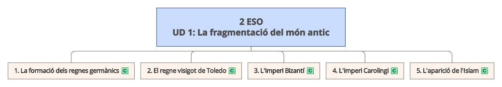
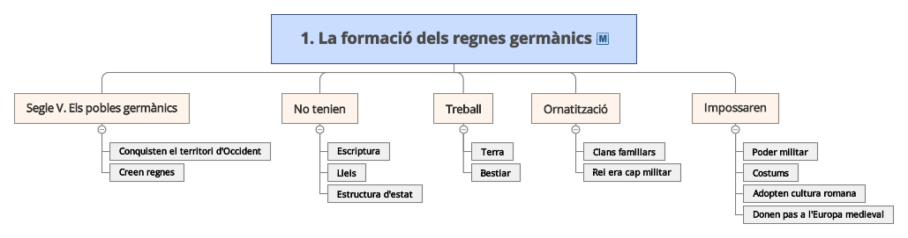
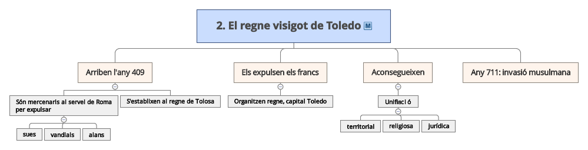

\newpage

# Introducció

**Any 409**: Els visigots van arribar a la península Ibèrica com aliats de Roma per a expulsar els invasors.

**Any 415**: Expulsen als bàndals i alans.

**Any 554**: Establixen la capital del regne a Toledo, n'estaran 200 anys.

# Organització del regne

Característiques del regne visigot:

- Monarquia forta
- Control de tot el territori peninsular
- Unificació jurídica i religiosa

**Any 711**: Disputes nobiliàries van afavorir que un exèrcit musulmà els derrotara.

Visigots a València: llegir.

