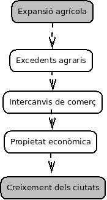

# El sorgiment de les ciutats

## 1. El final de les grans invacions ##

Al final del segle XI, a Europa es van acabar les invasions normandes (vikings). **Treva de Deu**.

## 2. Expansió agrària ##

A partir del segle XI es van produir **innovacions tècniques** que van portar un **augment de la productivitat**.

Els canvis essencials van ser:

- Nous mètodes de cultiu
- Nous instruments agrícoles
- Utilizació de molins de vent i molins d'aigua
- Es generava un excedent o sobrna de les materies primeres

\newpage

### 2.1. Eines ###

#### 2.1.1. Arada normanda de pala ####

- Collera
- Llança o jou
- Ganiveta
- Pala
- Cameta d'arrossegament

#### 2.1.2. Molí de vent ####

- Eix de les aspes
- Transport del gra mòlt
- Depòsit de gra ja mòlt
- Aspes
- Rodes dentades
- Tremuja o dipòsit de gra
- Pedres de molí

\newpage

### 2.2. Tècniques ###

#### 2.2.1 Rotació trienal ####

S'anava cultivant el camp per torns que anaven rotant per anys:

- blat
- civada
- guaret

## 3. Creixement de la població i rompudes  ##

L'increment de la **producció agrícola** fa permetre **millorar l'alimentació**.

Es va duplicar gairebé la població que hi havia al S. XII, al S. XIV.

Es van repoblar terres abandonades i van rompre altres de noves.

\newpage

### 4. Resorgiment del comerç i les ciutats ###

Van sorgir nous barris o **burgs**.

L'excedent de producció va fer que s'incrementara el comerç amb el Mediterrani oriental.

La persistència cristiana en aquella zona va donar pas a les **croades**.

Les **croades** tenin l'objectiu de reconquetar els llocs sants. Van participar-hi camperols, guerrers i cavallers.

