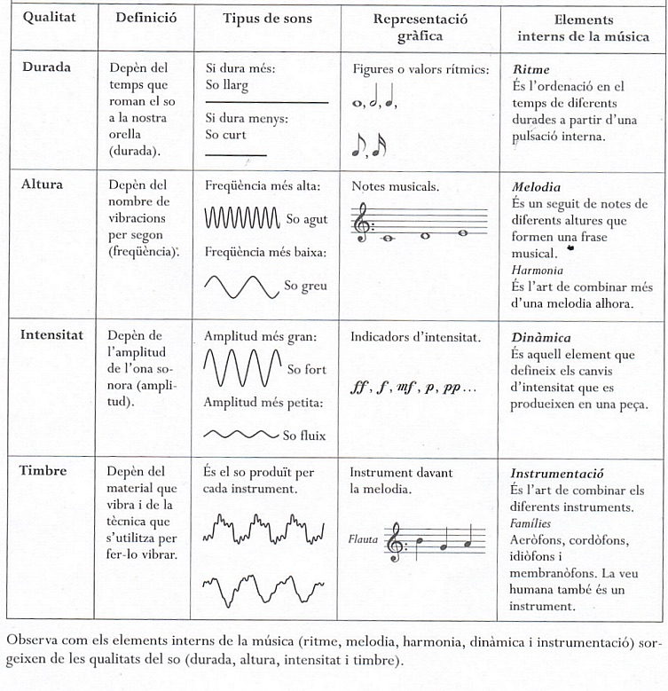

% Música 2 ESO - UD 1 Atrapar la música
% Llagostí
% Octubre 2016

# 0. Introducció

**Notació**: Codi que permet representar la música en un paper. Segle X.

**Fonografia**: Gravació i reproducció mecànica d'un so. Segle XX.

# 1. Escriptura del so

Les cultures musicals de la majoria de països del món són **àgrafes**, és a dir, no escriuen els son musicals sobre el paper.

La **notación musical** és el resultat d'j procés que es va prolongar durant un cinc cegles, del X al XV. La notació fa possible intermpretar i analitzar obres compostes fa segles.

## Característiques del so

El **so** és una vibració que es transmet a través de l'aire en forma d'ona.

El so musical es caracteritza per quatre **paràmetres** i una sèrie de **qualitats** pròpies de cada un.

| Paràmetres | Qualitats |
| --- | --- |
| Altura | Agut o greu |
| Durada | Llarg o curt |
| Intensitat | Fort o suau |
| Timbre | So caracerístic de l'instrument |

## 2. La interpretació expressiva

En la interpretació sempre hi ha alguna cosa nova o imprevista.

> Les **progressions melòdiques** són tènciques de construcció motiviques que consisteixen en prendre un model de més d’un element (melòdic o melòdic-harmònic) i repetir-lo pujant i baixant certs intervals.

## 3. Al·leluia, de Georg Friederich Häendel

## 4. La música i la tecnologia

La relació entre música i tecnologia no és un fet recent.

Després de l'arribada de la tecnologia digital, els recursos que s'han posat al servei de la música són molt nombrosos:

- **Generadors de sons**: sintetitzadors.
- **Processadors d'audio**: software.
- **Gravadors**: dispositius per capturar el so.
- **Reproductors de so**: dispositius per reproduir el so.

